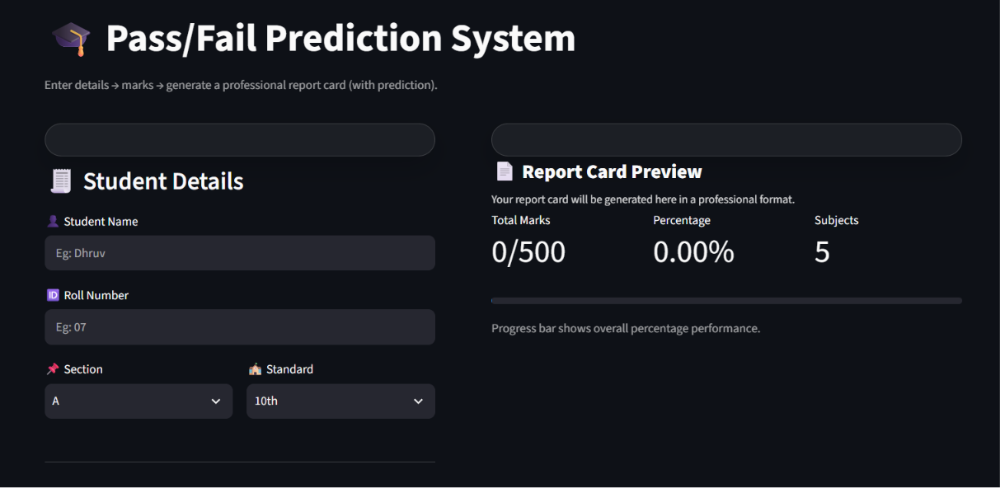
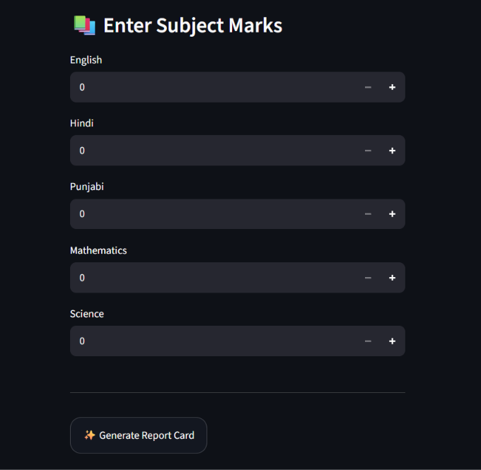
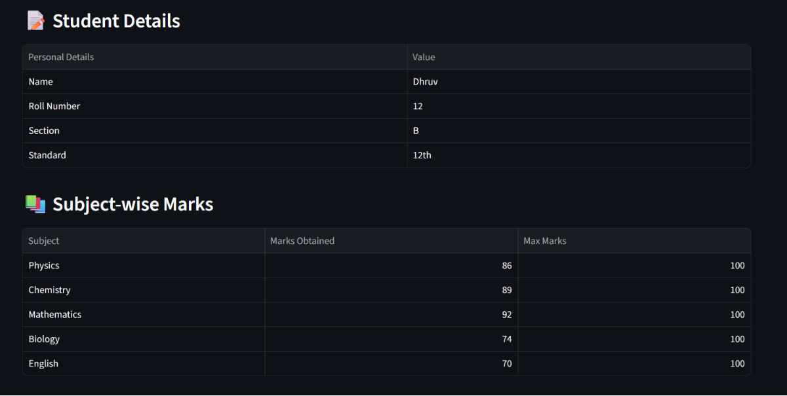
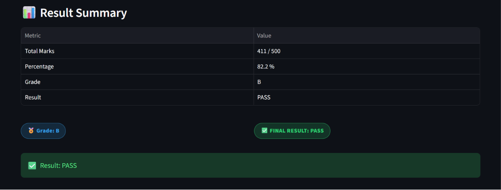

# 🎓 Student Pass/Fail Prediction System

A machine learning-based web application that generates professional student report cards and predicts whether a student will pass or fail using **Logistic Regression**. Built with **Python** and **Streamlit**, the application provides an interactive interface with live report previews and automatic result generation.

---

## 🚀 Live Demo

🔗 https://student-pass-fail-prediction-ml.streamlit.app/

---

## ✨ Features

- Generate professional student report cards
- Predict Pass/Fail using Logistic Regression
- Automatic percentage calculation
- Automatic grade generation
- Support for Class 10 and Class 12 students
- Interactive Streamlit interface
- Live report preview
- Responsive UI with custom CSS
- Professional report card layout

---

## 🛠️ Tech Stack

- Python
- Streamlit
- Scikit-learn
- Logistic Regression
- NumPy
- Pandas
- Joblib

---

## 📸 Screenshots

### 🏠 Home Screen



---

### 📝 Marks Entry



---

### 📋 Result Details



---

### 📊 Result Summary



---

## ⚙️ Installation

Clone the repository

```bash
git clone https://github.com/dhruv-bhoir-ai/student-pass-fail-prediction.git
```

Go to the project directory

```bash
cd student-pass-fail-prediction
```

Install dependencies

```bash
pip install -r requirements.txt
```

Run the application

```bash
streamlit run app.py
```

---

## 📂 Project Structure

```text
student-pass-fail-prediction
│
├── screenshots/
│   ├── home.png
│   ├── marks-entry.png
│   ├── result-details.png
│   └── result-summary.png
│
├── app.py
├── student_report_model.pkl
├── requirements.txt
└── README.md
```

---

## 🔮 Future Improvements

- Export report cards as PDF
- Store student records in a database
- Add user authentication
- Improve prediction accuracy with additional features
- Support multiple grading systems

---

## 👨‍💻 Author

**Dhruv Bhoir**

- GitHub: https://github.com/dhruv-bhoir-ai
- LinkedIn: https://www.linkedin.com/dhruv-bhoir-ai

---

⭐ If you found this project useful, consider giving it a star.
